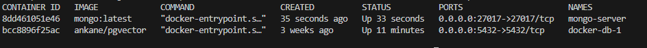
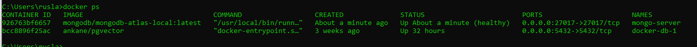
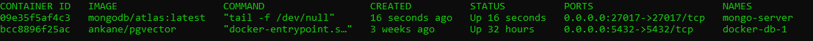
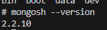
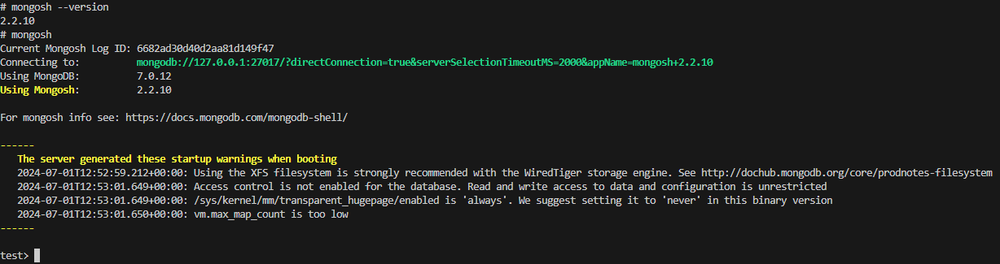
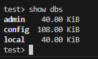
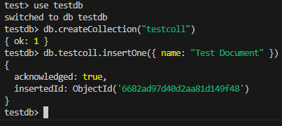
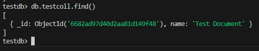

# How to Build a RAG System with Non Relational Database MongoDB Vector Database with WatsonX

Hello everyone, today we are going to build a RAG system in WatsonX with a MongoDB Vector Database.


## Setup


Install and start Docker.
To learn more, see the [Docker documentation](https://docs.docker.com/desktop/install/mac-install/).


## Mongo DB server

In this tutorial we are going to use Docker to install our server.

To use MongoDB with Docker, follow these easy steps:


Step 1:  Pull down the mongodb/mongodb-atlas-local Docker image.
```
docker pull mongo:latest
docker pull mongo/atlas:latest
docker pull mongodb/mongodb-atlas-local:latest
docker pull mongodb/atlas:latest

```


Step 2: Run the container.

```
docker run -d -p 27017:27017 --name=mongo-server mongo:latest
docker run -p 27017:27017 --name=mongo-server mongodb/mongodb-atlas-local:latest

docker run -d -p 27017:27017 --name=mongo-server mongodb/atlas:latest

```


Where the -d flag runs the container in detach (background) mode, -p 27017:27017  bound the container’s port 27017 to 27017  of the host, and –name=mongo-server will give a name to your container instead of an arbitrary name.

Step 3: Verify the state.

```
docker ps
```




As you can see the container is running successfully.

Step 4: Access the MongoDB shell in the running container
When you run `docker exec -it mongo-server /bin/sh`, you're executing a new command inside a running Docker container named `mongo-server`. Here's what's happening

```
docker exec -it mongo-server /bin/sh
````


Here

* `docker exec`: This command allows you to run a command inside a running Docker container.
* `-it`: These flags are used together to allocate a pseudo-TTY (`-t`) and keep the container running in the foreground (`-i`). This allows you to interact with the container as if you were sitting in front of it.
* `mongo-server`: This is the name of the Docker container you want to access.
* `/bin/sh`: This is the command to run inside the container. In this case, it's the Bourne shell (or a compatible shell like Bash).

Once you're inside the container, you can navigate to the `mongosh` directory using

```
cd bin 
```

`mongosh` is the MongoDB shell, which allows you to interact with your MongoDB instance.

To test if MongoDB is running and perform a simple test, you can use the following commands:

1. Check if the MongoDB service is running:
```
mongosh --version
```
This should display the version of MongoDB installed in the container.


2. Connect to the MongoDB instance using the `mongosh` shell:
```
mongosh
```
This will open the MongoDB shell, where you can execute MongoDB commands.




3. Run a simple query to test the connection:
```
show dbs
```
This command should list the available databases in your MongoDB instance.

4. Create a test database and collection:

```
use testdb
```
then
```
db.createCollection("testcoll")
```
This will create a new database named `testdb` and a collection named `testcoll` inside it.

5. Insert a test document:
```
db.testcoll.insertOne({ name: "Test Document" })
```
This will insert a new document into the `testcoll` collection.


6. Query the collection to verify the document was inserted:
```
db.testcoll.find()
```
This should display the document you just inserted.

If you can execute these commands successfully, it means that MongoDB is running inside the container, and you can interact with it using the `mongosh` shell.


## Creation of the enviroment


## Step 1. Python Installation
First, you need to install Python  `3.11.9` if you haven't already. You can download the latest version from [Python's official website](https://www.python.org/downloads/). 

1. **Check Python Version:**
   - In the Command Prompt, type the following command to verify that Python is correctly added to the PATH:
```bash
python --version
```


You should see an output similar to:

```bash
Python 3.10.11
```
if you have another version but you installed it
just you can type the path where you have installed python e.g.
```bash
C:\Python310\python.exe --version
```
and should be work
```bash
Python 3.11.9
```


### Step 2: Create and Activate Virtual Environment

The environment we will consider is Python 3.10 We will create a virtual environment called `.venv`, but you can name it whatever you like.

In your terminal, navigate to the directory where you want to create your project and run:

```bash
python -m venv .venv
```

Then, activate the virtual environment:

- **On Windows:**

```bash
.\.venv\Scripts\activate
```

- **On macOS and Linux:**

```bash
source .venv/bin/activate
```

Once the virtual environment is activated, you should see `(.venv)` preceding your terminal prompt. Now, upgrade `pip` and install the necessary packages:

```bash
python -m pip install --upgrade pip
```

```bash
pip install llama-index llama-index-vector-stores-mongodb llama-index-embeddings-openai  pymongo datasets pandas
```


### WatsonX Setup


#### 1. Create an IBM Cloud Account
First, ensure you have an IBM Cloud account. If not, sign up at [IBM Cloud](https://cloud.ibm.com/).

#### 2. Create a Watsonx.ai Project
1. **Log in to IBM Cloud**: Go to [IBM Cloud Dashboard](https://cloud.ibm.com/).
2. **Navigate to Watsonx.ai**: In the IBM Cloud dashboard, use the search bar to search for "Watsonx.ai" and select it.
3. **Create a Project**:
   - Click on `Create Project`.
   - Choose a project name and configure any necessary settings.
   - After creation, the project will appear in your list of projects.

#### 3. Retrieve the `PROJECT_ID`
1. **Open the Project**: Click on the name of your project from the list.
2. **Go to the Manage Tab**: Navigate to `Manage -> General`.
3. **Find the Project ID**: Under the `Details` section, you will find the `Project ID`. Copy this value for later use.

#### 4. Create an API Key
1. **Navigate to IAM (Identity and Access Management)**: In the IBM Cloud dashboard, go to `Manage -> Access (IAM)`.
2. **Create an API Key**:
   - Click on `API keys` on the left-hand side.
   - Click on `Create an IBM Cloud API key`.
   - Provide a name and description for the API key.
   - Click `Create`.
   - Once created, make sure to copy the API key as you won't be able to see it again.

### Setting Up the Environment

#### 5. Create a `.env` File
Create a `.env` file in your project directory to store the `PROJECT_ID` and `API_KEY`. This file should look like this:

```
PROJECT_ID=your_project_id_here
API_KEY=your_api_key_here
```

Replace `your_project_id_here` and `your_api_key_here` with the actual values you retrieved earlier.

```
pip install torch torchvision torchaudio --index-url https://download.pytorch.org/whl/cu118
```

pip install "ibm-watson-machine-learning>=1.0.321"