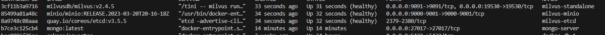

## Building a Movie Recommendation Engine with Docker, Milvus, MongoDB, and Watsonx.ai

Recommendation systems are the backbone of modern content platforms, personalizing experiences for users and driving engagement. In this tutorial, we'll guide you through building a movie recommender that combines the power of vector search (Milvus), structured data storage (MongoDB), and large language models (Watsonx.ai). We'll leverage Docker containers to streamline the setup and ensure portability.

**Key Technologies**

* **Docker:** Simplifies environment setup and deployment.
* **Milvus:** High-performance vector database for storing movie embeddings.
* **MongoDB:** NoSQL database for storing movie metadata.
* **Watsonx.ai:** Large language model (LLM) for generating recommendations.
* **Sentence Transformers:** Creates semantic embeddings for movie plot summaries.
* **LlamaIndex:** Connects components and enables querying.
* **Python:** Ties everything together with a simple, yet powerful script.

**Prerequisites**

* **Docker Desktop:** Install and run Docker on your machine.
* **Python Environment:** Set up a Python environment with the required libraries. Use the following command to install them: 

```bash
pip install sentence-transformers llama-index llama-index-vector-stores-mongodb pymilvus pymongo ibm-watsonx-ai ibm_watson_machine_learning
```

* **Watsonx.ai API Key:** Obtain API credentials from IBM's Watsonx.ai platform.


**Step 1: Dockerize MongoDB**

1. Pull the MongoDB Docker image:

```bash
docker pull mongo:latest
```

2. Run a MongoDB container, mapping the default port (27017) to your host:

```bash
docker run -d -p 27017:27017 --name mongo-server mongo:latest
```
3. Verify that the container is running:

```bash
docker ps
```
You should see `mongo-server` listed.


**Step 2: Dockerize Milvus**

1. Pull the Milvus Docker image:

```bash
$ wget https://github.com/milvus-io/milvus/releases/download/v2.4.5/milvus-standalone-docker-compose.yml -O docker-compose.yml
$ sudo docker compose up -d
```

2. Run a Milvus container, exposing the default port (19530):

```bash

```
After starting up Milvus,

Containers named milvus-standalone, milvus-minio, and milvus-etcd are up.
The milvus-etcd container does not expose any ports to the host and maps its data to volumes/etcd in the current folder.
The milvus-minio container serves ports 9090 and 9091 locally with the default authentication credentials and maps its data to volumes/minio in the current folder.
The milvus-standalone container serves ports 19530 locally with the default settings and maps its data to volumes/milvus in the current folder.
You can check if the containers are up and running using the following command:
3. Verify that the container is running:
```bash
docker ps
```
You should see `milvus` listed.


**Step 3: Prepare Your Data**

1. **Movie Data:**  Import your movie dataset into MongoDB. Make sure your collection has a field called `fullplot` containing movie plot summaries.
2. **Environment Variables:** Create a `.env` file to store your credentials:

```
MONGO_HOST=localhost
MONGO_PORT=27017
DB_NAME=movies
COLLECTION_NAME=movies_records
WATSONX_URL=your_watsonx_url
WATSONX_API_KEY=your_watsonx_api_key
MILVUS_HOST=localhost
MILVUS_PORT=19530
```

**Step 4: Run the Python Code**

Save the provided Python code as a file (e.g., `movie_recommender.py`) and execute it:

```bash
python movie_recommender.py
```

The script will connect to your databases, embed movie plots, store them in Milvus, and set up the LlamaIndex for querying.

**Step 5: Query for Recommendations**

```python
query_engine = index.as_query_engine()
response = query_engine.query("Recommend a romantic movie suitable for the Christmas season")
print(response)
```

Replace `"Recommend a romantic movie suitable for the Christmas season"` with your own query to get personalized recommendations.


**How it Works**

1. **Data Retrieval:** The script fetches movie data from MongoDB.
2. **Embedding:**  Sentence Transformers converts movie plots into numerical vectors capturing their semantic meaning.
3. **Milvus Storage:** Milvus stores these embeddings efficiently for fast similarity search.
4. **LlamaIndex:** Builds an index over the Milvus vector store, connecting it to Watsonx.ai.
5. **Querying:**  Your query is embedded, and Milvus finds similar movie plots. Watsonx.ai generates a natural language recommendation based on the results.
